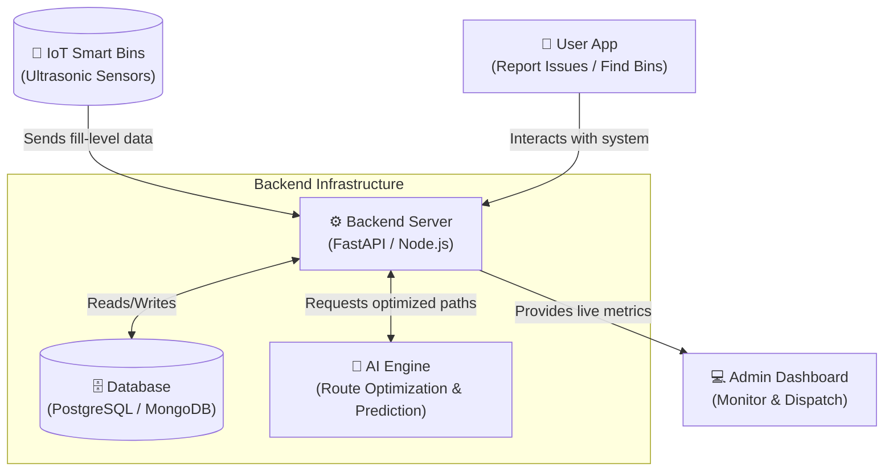

# 🌍 AI-for-Better-Living-and-Smarter-Communities: Campus Waste Management System

Welcome to the **Campus Waste Management System**, an AI-driven solution designed to optimize waste collection and improve sanitation across smart communities and campuses.

## 📖 Description

The traditional waste management process is often inefficient, leading to overflowing bins or unnecessary collection trips. This system leverages AI, IoT, and modern web technologies to create a smarter, data-driven approach to waste management. 

By monitoring bin levels in real-time, predicting waste generation patterns, and optimizing collection routes, this project aims to reduce operational costs, minimize environmental impact, and promote a cleaner, healthier living space for the community.

## 🏗️ System Architecture

The architecture consists of IoT sensors for real-time monitoring, a robust backend API, an AI service for route optimization, and front-end interfaces for both users and administrators.



## ✨ Key Features

- **Real-Time Bin Monitoring:** IoT sensors track the fill level of waste bins across the campus and send data to the central server.
- **AI Route Optimization:** Machine learning algorithms determine the most efficient collection routes for garbage trucks based on bin fill levels, saving fuel and time.
- **Predictive Analytics:** Analyzes historical data to predict when bins will be full, allowing for proactive scheduling.
- **Interactive Dashboards:** 
  - *Admin:* View live statuses, manage fleet, and analyze waste generation trends.
  - *User:* Locate the nearest empty bins, learn about recycling, and report sanitation issues.
- **Automated Alerts:** Notifications are triggered when a bin reaches critical capacity.

## 🛠️ Technology Stack

- **Backend:** Python (FastAPI/Flask) - *Handles API requests, data processing, and business logic.*
- **Database:** PostgreSQL or MongoDB - *Stores user data, bin locations, and historical fill-level logs.*
- **AI/ML:** Scikit-Learn, TensorFlow, or custom OR-Tools - *For predictive modeling and route optimization.*
- **IoT Integration:** MQTT or HTTP protocols for sensor communication.
- **Frontend (Planned):** React.js (Dashboard) & Flutter/React Native (Mobile App).

## 🚀 Setup & Installation (Backend)

The backend component (`campus-waste-backend`) handles the core logic.

1. **Clone the repository:**
   ```bash
   git clone https://github.com/Kishan-shah12/AI-for-Better-Living-and-Smarter-Communities.git
   cd "AI for Better Living and Smarter Communities/campus-waste-backend"
   ```

2. **Create a virtual environment:**
   ```bash
   python -m venv venv
   source venv/bin/activate  # On Windows use `venv\Scripts\activate`
   ```

3. **Install dependencies:**
   ```bash
   # (Assuming a requirements.txt will be created)
   # pip install -r requirements.txt
   ```

4. **Environment Variables:**
   Create a `.env` file in the backend directory (refer to `.env.example` if available) and add necessary configurations such as Database URI.

5. **Run the server:**
   ```bash
   # Example for FastAPI
   # uvicorn main:app --reload
   ```

## 🤝 Contributing

Contributions are welcome! Please feel free to submit a Pull Request.

## 📄 License

This project is licensed under the MIT License - see the LICENSE file for details.